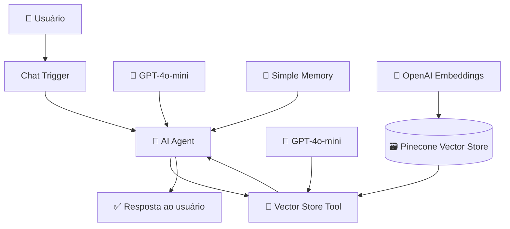

# 🤖 Chatbot RAG com n8n, OpenAI e Pinecone

Chatbot inteligente desenvolvido no **n8n** utilizando uma arquitetura baseada em **RAG (Retrieval-Augmented Generation)** para responder perguntas a partir de uma base de conhecimento armazenada no **Pinecone**.

O sistema combina um **AI Agent**, modelos da **OpenAI**, **embeddings**, busca vetorial e memória conversacional para recuperar informações relevantes antes de gerar a resposta.

> O objetivo é fazer com que o modelo utilize informações recuperadas da base vetorial como contexto, em vez de depender apenas do conhecimento geral do LLM.

---

## 🚀 Principais funcionalidades

- 💬 Interface de chat integrada ao n8n
- 🤖 Agente de IA responsável por interpretar as perguntas
- 🔎 Busca semântica em banco vetorial
- 🧠 Arquitetura RAG
- 📚 Consulta a uma base de conhecimento personalizada
- 🔢 Embeddings gerados com OpenAI
- 🗃️ Armazenamento e recuperação vetorial com Pinecone
- 💾 Memória das últimas interações
- 🔧 Uso do Vector Store como ferramenta do agente
- ⚡ Geração de respostas com GPT-4o-mini

---

## 🧠 Arquitetura

O workflow utiliza um **AI Agent** como núcleo da aplicação. O agente interpreta a pergunta do usuário, mantém o contexto da conversa e, quando necessário, consulta a base de conhecimento no **Pinecone** por meio de busca semântica.

### 🔄 Fluxo da consulta

1. O usuário envia uma pergunta pelo **Chat Trigger**.
2. O **AI Agent** interpreta a solicitação utilizando o **GPT-4o-mini**.
3. A **Simple Memory** mantém o contexto recente da conversa.
4. Quando necessário, o agente aciona a ferramenta de consulta à base vetorial.
5. A pergunta é representada por **OpenAI Embeddings**.
6. O **Pinecone** recupera os conteúdos semanticamente mais relacionados.
7. O conteúdo recuperado é utilizado como contexto pelo modelo.
8. O **AI Agent** gera a resposta final para o usuário.

## 🔄 Como funciona
1. Entrada da pergunta

O fluxo começa no nó Chat Trigger, que disponibiliza uma interface de chat para interação com o usuário.

A mensagem é enviada diretamente ao AI Agent.

2. Interpretação pelo AI Agent

O agente utiliza o modelo:

GPT-4o-mini

com temperatura configurada em:

0.7

O prompt de sistema orienta o agente a responder utilizando as informações disponíveis na base vetorial do Pinecone.

O agente também verifica se uma ferramenta pode ser utilizada para responder à solicitação.

3. Recuperação de informações

O agente possui acesso à ferramenta:

Answer questions with a vector store

Essa ferramenta permite consultar a base de conhecimento armazenada no Pinecone.

A pergunta é representada semanticamente por meio de embeddings, permitindo localizar conteúdos relacionados ao significado da consulta.

4. Busca vetorial

O projeto utiliza:

Pinecone Vector Store

com o índice:

n8n

O Pinecone realiza a recuperação dos vetores semanticamente relacionados à pergunta.

Isso permite encontrar informações mesmo quando a pergunta não utiliza exatamente as mesmas palavras presentes nos documentos originais.

5. Geração da resposta

Após recuperar o contexto relevante, outro modelo GPT-4o-mini é utilizado pela ferramenta de Vector Store para trabalhar com os dados recuperados.

O resultado retorna ao AI Agent, que produz a resposta final para o usuário.

💾 Memória Conversacional

O chatbot utiliza:

Simple Memory

com uma janela de contexto configurada para:

25 interações

Isso permite manter parte do contexto da conversa e interpretar perguntas relacionadas a mensagens anteriores.

Exemplo
Usuário:
Qual é a política de férias da empresa?

Assistente:
[resposta baseada na base de conhecimento]

Usuário:
E como funciona para quem entrou este ano?

A memória ajuda o agente a compreender que a segunda pergunta continua relacionada ao assunto anterior.

🔎 Busca Semântica

O sistema utiliza embeddings para representar o significado dos textos matematicamente.

Isso permite recuperar informações por similaridade semântica, e não somente por palavras-chave.

Exemplo

Um documento pode conter:

Os colaboradores possuem direito a trinta dias
de descanso remunerado após o período aquisitivo.

Enquanto o usuário pergunta:

Quantos dias de férias um funcionário possui?

Mesmo sem correspondência exata entre as palavras, os embeddings podem identificar a proximidade semântica entre os conteúdos.

🛠️ Tecnologias Utilizadas
⚙️ Automação e Orquestração

n8n

🤖 Inteligência Artificial

OpenAI API
GPT-4o-mini
AI Agent
LLMs

🔢 Representação Vetorial

OpenAI Embeddings
Vector Embeddings

🗃️ Banco Vetorial

Pinecone

🧠 Arquitetura e Conceitos

Retrieval-Augmented Generation (RAG)
Semantic Search
Vector Search
Similarity Search
Tool Calling
Context Retrieval
Conversational Memory

🧩 Nodes principais do workflow
Node	Função
chat	Recebe as mensagens do usuário
AI Agent	Interpreta a solicitação e coordena a resposta
OpenAI Chat Model	Modelo principal utilizado pelo agente
Simple Memory	Mantém o contexto recente da conversa
Answer questions with a vector store	Ferramenta usada pelo agente para consultar a base
Pinecone Vector Store	Recupera informações da base vetorial
Embeddings OpenAI	Gera representações vetoriais
OpenAI Chat Model	Trabalha com o conteúdo recuperado
🎯 Fluxo RAG
Pergunta
   ↓
AI Agent
   ↓
Consulta ao Vector Store
   ↓
Embedding da consulta
   ↓
Busca semântica no Pinecone
   ↓
Recuperação de contexto
   ↓
GPT-4o-mini
   ↓
AI Agent
   ↓
Resposta
📚 Base de Conhecimento

Este workflow realiza a consulta à base vetorial.

Os documentos precisam ser processados e inseridos previamente no Pinecone através de outro workflow, script ou processo de ingestão.

Um pipeline de ingestão pode seguir a estrutura:

Documento
   ↓
Extração de texto
   ↓
Chunking
   ↓
OpenAI Embeddings
   ↓
Pinecone

Esse processo é independente do workflow de consulta apresentado neste repositório.

🎯 Possíveis aplicações

A mesma arquitetura pode ser utilizada para diferentes bases de conhecimento.

🏢 Empresas
Políticas internas
Procedimentos
Documentação corporativa
Manuais
👥 Recursos Humanos
Benefícios
Férias
Licenças
Normas internas
⚖️ Jurídico
Contratos
Regulamentos
Documentos jurídicos
🎓 Educação e Pesquisa
Artigos científicos
Apostilas
Materiais didáticos
Bases acadêmicas
🛠️ Suporte
FAQs
Documentação técnica
Manuais
Base de conhecimento de produtos
🔮 Possíveis Evoluções
 Criar workflow próprio para ingestão de documentos
 Upload automático de PDFs
 Chunking configurável
 Armazenamento de metadados
 Citação automática das fontes
 Filtros por documento ou categoria
 Re-ranking dos resultados recuperados
 Memória persistente
 Autenticação de usuários
 Controle de acesso por base documental
 Avaliação automática da qualidade das respostas
 Observabilidade e logs das consultas
⚠️ Observação sobre RAG

O uso de RAG ajuda a produzir respostas mais fundamentadas na base de conhecimento, mas não elimina completamente possíveis erros ou alucinações do modelo.

A qualidade final depende de fatores como:

qualidade dos documentos;
estratégia de chunking utilizada na ingestão;
modelo de embeddings;
qualidade da recuperação vetorial;
prompt do agente;
quantidade e relevância dos trechos recuperados.
📚 O que este projeto demonstra

n8n • RAG • OpenAI • GPT-4o-mini • Pinecone • AI Agents • Embeddings • Vector Database • Semantic Search • Tool Calling • Conversational Memory

👩‍💻 Autora

Lara Santos Pereira Soares

💼 LinkedIn
🐙 GitHub

⭐ Se este projeto foi interessante, considere deixar uma Star no repositório.

