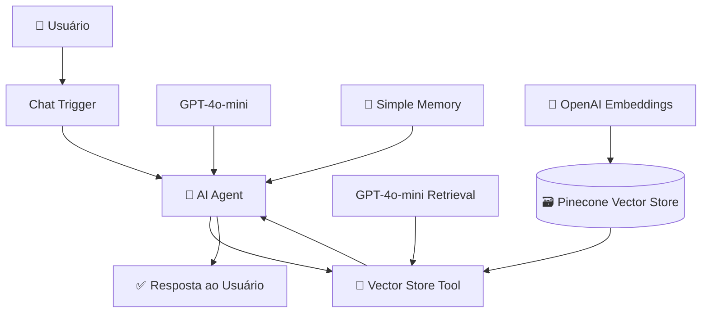

# 🤖 Chatbot RAG com n8n, OpenAI e Pinecone

Assistente inteligente desenvolvido no **n8n** utilizando uma arquitetura **RAG (Retrieval-Augmented Generation)** para responder perguntas com base em uma base de conhecimento armazenada no **Pinecone**.

O projeto combina **AI Agent**, **GPT-4o-mini**, **OpenAI Embeddings**, busca vetorial, memória conversacional e **Pinecone** para recuperar informações relevantes antes de gerar uma resposta.

> Em vez de depender apenas do conhecimento geral do modelo de linguagem, o chatbot consulta uma base de conhecimento e utiliza o conteúdo recuperado como contexto para responder ao usuário.

---

## 🚀 Principais Funcionalidades

- 💬 Interface de chat integrada ao n8n
- 🤖 Agente de IA para interpretação das perguntas
- 🔎 Busca semântica em banco vetorial
- 🧠 Arquitetura RAG
- 📚 Consulta a uma base de conhecimento personalizada
- 🔢 Geração de embeddings com OpenAI
- 🗃️ Recuperação vetorial utilizando Pinecone
- 💾 Memória contextual da conversa
- 🔧 Uso do Vector Store como ferramenta do agente
- ⚡ Geração de respostas com GPT-4o-mini

---

## 🧠 Arquitetura

O workflow utiliza um **AI Agent** como núcleo da aplicação.

O agente recebe a pergunta do usuário, mantém o contexto recente da conversa e, quando necessário, utiliza uma ferramenta de busca vetorial para consultar informações armazenadas no **Pinecone**.



---

## 🔄 Como Funciona

### 1. Entrada da Pergunta

O fluxo começa no **Chat Trigger**, responsável por receber as mensagens enviadas pelo usuário.

A pergunta é encaminhada diretamente para o **AI Agent**.

---

### 2. Interpretação pelo AI Agent

O agente utiliza o modelo:

`GPT-4o-mini`

com temperatura configurada em:

`0.7`

O agente analisa a solicitação do usuário e verifica se a base de conhecimento pode ser utilizada para responder à pergunta.

---

### 3. Consulta à Base Vetorial

Quando necessário, o agente utiliza a ferramenta:

`Answer Questions with Vector Store`

Essa ferramenta permite consultar a base de conhecimento armazenada no **Pinecone**.

A consulta é transformada em uma representação vetorial utilizando **OpenAI Embeddings**.

---

### 4. Busca Semântica

O **Pinecone Vector Store** realiza uma busca por similaridade entre a pergunta do usuário e os conteúdos armazenados.

Isso permite encontrar informações relacionadas ao **significado da pergunta**, e não apenas correspondências exatas de palavras.

---

### 5. Recuperação do Contexto

Os conteúdos semanticamente mais relacionados à pergunta são recuperados da base vetorial.

Essas informações são utilizadas como contexto pelo modelo de linguagem responsável pela recuperação.

---

### 6. Geração da Resposta

O conteúdo recuperado retorna ao **AI Agent**, que utiliza essas informações para gerar uma resposta clara e contextualizada para o usuário.

---

## 🔄 Fluxo RAG

```text
Pergunta do usuário
        ↓
    Chat Trigger
        ↓
      AI Agent
        ↓
Vector Store Tool
        ↓
OpenAI Embeddings
        ↓
Busca Semântica
        ↓
Pinecone Vector Store
        ↓
Recuperação do Contexto
        ↓
    GPT-4o-mini
        ↓
      AI Agent
        ↓
Resposta ao Usuário
```

---

## 💾 Memória Conversacional

O projeto utiliza **Simple Memory** para manter o contexto recente da conversa.

A janela de memória está configurada para:

`25`

Isso permite que o chatbot interprete perguntas relacionadas às mensagens anteriores.

### Exemplo

**Usuário:**

> Qual é a política de férias da empresa?

**Assistente:**

> [Resposta baseada na base de conhecimento]

**Usuário:**

> E como funciona para quem entrou este ano?

Nesse caso, a memória ajuda o agente a compreender que a segunda pergunta continua relacionada ao assunto anterior.

---

## 🔎 Busca Semântica

A busca vetorial permite localizar informações com base no significado dos textos.

Por exemplo, um documento pode conter:

> Os colaboradores possuem direito a trinta dias de descanso remunerado após o período aquisitivo.

Enquanto o usuário pergunta:

> Quantos dias de férias um funcionário possui?

Mesmo sem utilizar exatamente as mesmas palavras, os **embeddings** permitem identificar a proximidade semântica entre os conteúdos.

---

## 🛠️ Tecnologias Utilizadas

### ⚙️ Automação e Orquestração

- **n8n**

### 🤖 Inteligência Artificial

- **OpenAI API**
- **GPT-4o-mini**
- **AI Agent**
- **Large Language Models (LLMs)**

### 🔢 Representação Vetorial

- **OpenAI Embeddings**
- **Vector Embeddings**

### 🗃️ Banco Vetorial

- **Pinecone**

### 🧠 Arquitetura e Conceitos

- Retrieval-Augmented Generation (RAG)
- Semantic Search
- Vector Search
- Similarity Search
- Tool Calling
- Context Retrieval
- Conversational Memory

---

## 🧩 Principais Nodes do Workflow

| Node | Função |
| --- | --- |
| `Chat Trigger` | Recebe as mensagens do usuário |
| `AI Agent` | Interpreta a solicitação e coordena a resposta |
| `OpenAI Chat Model - Agent` | Modelo de linguagem utilizado pelo agente principal |
| `Simple Memory` | Mantém o contexto recente da conversa |
| `Answer Questions with Vector Store` | Ferramenta utilizada para consultar a base vetorial |
| `Pinecone Vector Store` | Realiza a recuperação das informações armazenadas |
| `OpenAI Embeddings` | Gera as representações vetoriais das consultas |
| `OpenAI Chat Model - Retrieval` | Processa as informações recuperadas pelo Vector Store |

---

## 📚 Base de Conhecimento

Este workflow é responsável pela **consulta da base vetorial**.

Os documentos precisam estar previamente processados e armazenados no **Pinecone**.

A ingestão dos documentos pode ser realizada por outro workflow ou processo separado.

Um pipeline de ingestão típico pode seguir esta estrutura:

```text
Documento
    ↓
Extração de Texto
    ↓
Divisão em Chunks
    ↓
OpenAI Embeddings
    ↓
Pinecone
```

O processo de ingestão não faz parte deste workflow de consulta.

---

## 🎯 Possíveis Aplicações

A mesma arquitetura pode ser utilizada em diferentes contextos.

### 🏢 Empresas

- Políticas internas
- Procedimentos
- Documentação corporativa
- Manuais
- Bases de conhecimento internas

### 👥 Recursos Humanos

- Benefícios
- Férias
- Licenças
- Normas internas
- Procedimentos de RH

### ⚖️ Jurídico

- Contratos
- Regulamentos
- Documentos jurídicos
- Normas internas

### 🎓 Educação e Pesquisa

- Artigos científicos
- Apostilas
- Materiais didáticos
- Documentação acadêmica
- Bases personalizadas de pesquisa

### 🛠️ Suporte Técnico

- FAQs
- Documentação técnica
- Manuais
- Base de conhecimento de produtos
- Procedimentos de atendimento

---

## 💡 Por que utilizar RAG?

A arquitetura **Retrieval-Augmented Generation** permite combinar a capacidade de geração dos modelos de linguagem com informações externas armazenadas em uma base de conhecimento.

Entre as principais vantagens estão:

- 🔎 Busca por significado
- 📚 Uso de informações específicas da aplicação
- ⚡ Consulta rápida em grandes bases documentais
- 🔄 Atualização da base sem necessidade de treinar novamente o modelo
- 🧠 Respostas mais contextualizadas
- 📌 Possibilidade de adicionar rastreabilidade e fontes
- 🛡️ Redução de respostas desconectadas da base de conhecimento

---

## ⚠️ Confiabilidade

A utilização de RAG ajuda a reduzir respostas sem fundamentação, mas não elimina completamente possíveis erros ou alucinações de modelos de linguagem.

A qualidade da resposta depende de fatores como:

- qualidade dos documentos;
- estratégia de chunking utilizada na ingestão;
- modelo de embeddings;
- qualidade da recuperação vetorial;
- quantidade de informações recuperadas;
- prompt utilizado pelo agente;
- relevância dos conteúdos armazenados.

Em aplicações críticas, mecanismos adicionais de validação e rastreabilidade são recomendados.

---

## 🔮 Possíveis Evoluções

- [ ] Criar workflow próprio para ingestão de documentos
- [ ] Upload automático de arquivos
- [ ] Suporte ampliado a PDF
- [ ] Chunking configurável
- [ ] Armazenamento de metadados
- [ ] Citação automática das fontes
- [ ] Filtros por documento ou categoria
- [ ] Re-ranking dos resultados recuperados
- [ ] Memória persistente
- [ ] Autenticação de usuários
- [ ] Controle de acesso
- [ ] Histórico de conversas
- [ ] Observabilidade e logs
- [ ] Avaliação automática da qualidade das respostas

---

## 📚 O que este Projeto Demonstra

Este projeto demonstra conhecimentos em:

`n8n` • `RAG` • `OpenAI` • `GPT-4o-mini` • `Pinecone` • `AI Agents` • `Embeddings` • `Vector Database` • `Semantic Search` • `Tool Calling` • `Conversational Memory`

---

## 👩‍💻 Autora

**Lara Santos Pereira Soares**

📧 **E-mail:** [lara.sps.dev@gmail.com](mailto:lara.sps.dev@gmail.com)  
💼 **LinkedIn:** [Lara Santos](https://www.linkedin.com/in/lara-santos-668a97326/)
---

⭐ Se este projeto foi interessante, considere deixar uma **Star** no repositório.


